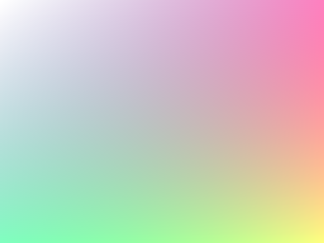
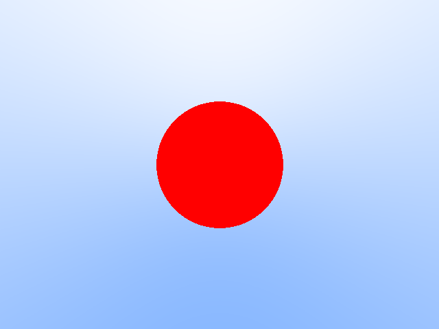
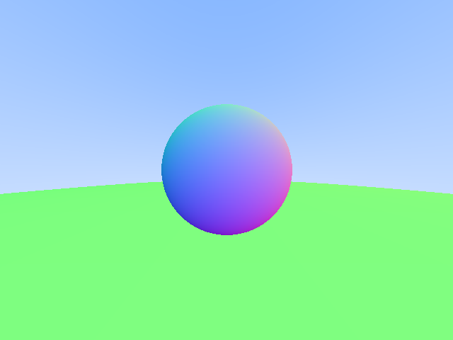
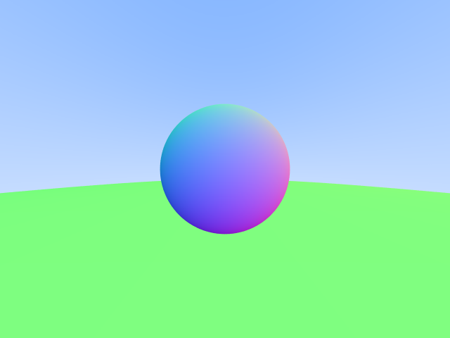
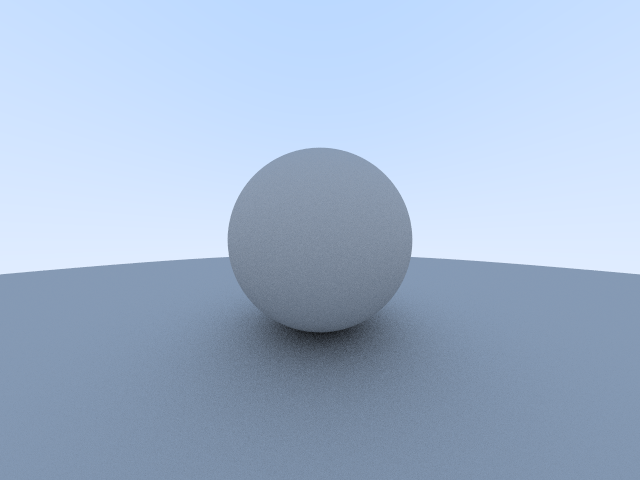

# BasicRayTracing

Implement basic ray tracing following ["Ray Tracing in One Weekend"](https://github.com/RayTracing/raytracinginoneweekend)

## Chapters

- [x] Chapter1: Output an image
- [x] Chapter2: The vec3 class
- [x] Chapter3: : Rays, a simple camera, and background
- [x] Chapter4: Adding a sphere
- [x] Chapter5: Surface normals and multiple objects
- [x] Chapter6: Antialiasing
- [ ] Chapter7: Diffuse Materials
- [ ] Chapter8: Metal
- [ ] Chapter9: Dielectrics
- [ ] Chapter10: Positionable camera
- [ ] Chapter11: Defocus Blur
- [ ] Chapter12: Where next?

## Images

### Chapter1

### Chapter3

### Chapter4

### Chapter5

### Chapter6

### Chapter7

